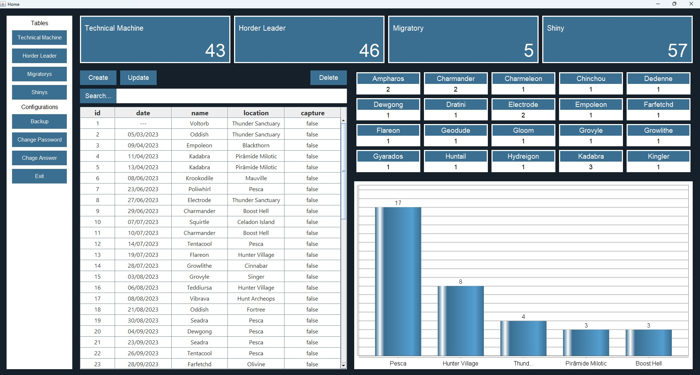

# otPokemon Statistics Manager

### 📌 Overview
The **otPokemon Statistics Manager** is a personal project developed to store and manage some statistics from the **otPokemon** game.

Before this project, all statistics were recorded in a notebook. When I started studying software development, I decided to create a desktop system to meet this personal need, as well as to reinforce and practice the concepts learned in the classroom.

---

### 🏗️ Architecture
The system follows a structure inspired by MVC:

- **Model:** SQLite database
- **View:** Java Swing
- **Controller:** Intermediary between model and view

This separation helps keep the code organized, easy to maintain, and extend.

---

### ⚙️ Technologies Used
- **Java**
- **Java Swing**
- **JFreeChart**
- **SQLite**
- **JUnit**

---

### ✨ Features
- **CRUD operations** for game statistics
- **Search bar** to further filter the search using `TableRowSorter`
- **Database backup export** using `JFileChooser`
- **User authentication**, including a security question when changing the password
- **Dynamic user interface updates** using the Observer pattern
- **Responsive interface layout** using `GridBagLayout`

---

### 📊 UI/UX

The interface was built with a focus on responsiveness, dynamically adapting components based on user interactions and data updates.

Graphs are dynamically generated to visualize statistics, providing a more detailed, filtered view.

---

### 🎯 Project Objectives
- Replace a manual paper-based process with a digital solution
- Practice Java desktop development
- Apply object-oriented programming concepts
- Apply software architecture concepts
- Apply software testing concepts
